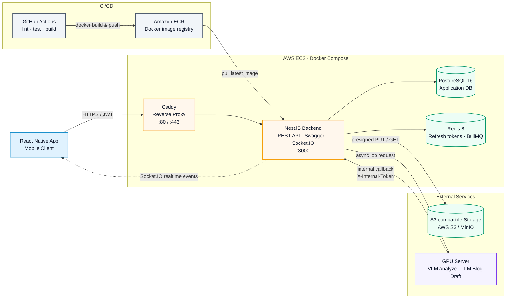
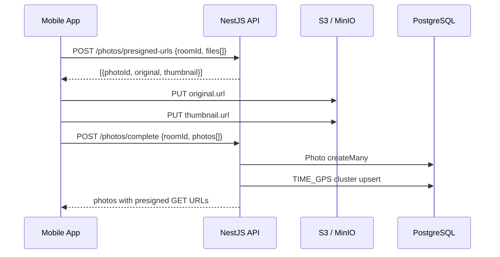

# NEXT Backend

AI 여행 사진 정리, 여행방 공유, 사진 클러스터링, AI 블로그 초안 생성을 담당하는 NestJS 백엔드입니다.

## 한눈에 보기

- Runtime: Node.js 22, pnpm 10.33.0
- Framework: NestJS 11, Prisma 7, Socket.IO, BullMQ
- Storage: PostgreSQL 16, Redis 8, S3 호환 스토리지(AWS S3 또는 MinIO)
- Docs: Swagger UI at `http://localhost:3000/docs`
- Health check: `GET /health`

## 인프라 아키텍처



GitHub Actions가 Docker 이미지를 빌드해 Amazon ECR에 push하고, EC2의 Docker Compose 스택이 최신 이미지를 pull해 Caddy, NestJS API, PostgreSQL, Redis를 함께 운영합니다. 사진 객체는 S3 호환 스토리지에 저장하고, VLM/LLM 작업은 GPU 서버와 내부 콜백으로 비동기 처리합니다.

## 주요 기능

- 이메일 회원가입/로그인, Google ID Token 로그인, JWT access/refresh token 재발급 및 로그아웃
- 여행방 생성, 초대 토큰 기반 참가, OWNER 권한 관리, 방별 마커 설정
- S3 presigned PUT URL 기반 원본/썸네일 업로드 및 presigned GET URL 반환
- 촬영 시간과 GPS를 활용한 기본 사진 클러스터링
- GPU 서버 연동을 통한 VLM 사진 분석, 장면 클러스터 제안, LLM 블로그 초안 생성
- Socket.IO `/realtime` 네임스페이스를 통한 방 단위 작업 진행 이벤트
- Docker 기반 로컬 인프라와 ECR/EC2 배포용 compose 구성

## 프로젝트 구조

```text
.
├── src
│   ├── app.module.ts
│   ├── main.ts
│   ├── config/              # 환경변수 스키마와 타입
│   ├── common/              # guards, decorators, filters
│   ├── health/              # DB/Redis 상태 확인
│   ├── prisma/              # PrismaService
│   ├── redis/               # RedisService
│   ├── s3/                  # S3 presigned URL 유틸
│   └── modules/
│       ├── auth/            # 이메일/Google 로그인, JWT
│       ├── users/
│       ├── rooms/           # 여행방, 멤버십, 초대 토큰, 마커
│       ├── photos/          # presigned upload, 사진 저장/조회/삭제
│       ├── clusters/        # 시간/GPS 및 AI 클러스터 조회/수정
│       ├── gpu-jobs/        # BullMQ 작업, GPU 서버 호출, 내부 콜백
│       ├── realtime/        # Socket.IO room subscribe/event emit
│       └── blogs/           # 블로그 CRUD, AI 초안 생성 요청
├── prisma/
│   ├── schema.prisma
│   ├── migrations/
│   └── seed.ts
├── test/                    # e2e tests
├── docker-compose.yml       # local PostgreSQL/Redis/MinIO
├── docker-compose.prod.yml  # EC2 production compose
├── Dockerfile
└── Caddyfile
```

## 로컬 실행

### 1. 사전 요구사항

- Node.js 22 LTS
- pnpm 10.33.0
- Docker Desktop 또는 Docker Compose V2

### 2. 환경변수 준비

```bash
cp .env.example .env
```

필수로 확인할 값:

| 변수                                         | 설명                                                                                                                     |
| -------------------------------------------- | ------------------------------------------------------------------------------------------------------------------------ |
| `DATABASE_URL`                               | PostgreSQL 연결 문자열                                                                                                   |
| `REDIS_HOST`, `REDIS_PORT`                   | Redis 연결 정보                                                                                                          |
| `JWT_ACCESS_SECRET`, `JWT_REFRESH_SECRET`    | 각각 32자 이상. `openssl rand -hex 32` 권장                                                                              |
| `GOOGLE_CLIENT_ID`                           | Google ID Token 검증용 client id. 로컬에서 Google 로그인을 쓰지 않아도 비어 있으면 앱이 뜨지 않으므로 더미 값이라도 필요 |
| `S3_BUCKET`                                  | S3/MinIO 버킷 이름                                                                                                       |
| `S3_ENDPOINT`                                | 로컬 MinIO 사용 시 `http://localhost:9000`                                                                               |
| `AWS_ACCESS_KEY_ID`, `AWS_SECRET_ACCESS_KEY` | 로컬 MinIO 기본값은 `minioadmin` / `minioadmin`                                                                          |
| `GPU_SERVER_URL`                             | GPU 서버 base URL. 기본값은 `http://localhost:8001`                                                                      |
| `GPU_INTERNAL_TOKEN`                         | GPU 서버와 내부 콜백 인증에 쓰는 토큰                                                                                    |
| `CALLBACK_BASE_URL`                          | GPU 서버가 다시 호출할 백엔드 공개 URL                                                                                   |

로컬 MinIO를 쓸 때는 `.env.example`의 MinIO 관련 주석을 해제하고, MinIO 콘솔(`http://localhost:9001`) 또는 `mc` CLI로 `S3_BUCKET` 버킷을 만들어야 합니다.

### 3. 의존성과 로컬 인프라 실행

```bash
pnpm install
docker compose up -d postgres redis minio
pnpm prisma:generate
pnpm prisma:migrate
pnpm start:dev
```

서버가 올라오면 다음 주소를 확인합니다.

- API: `http://localhost:3000`
- Swagger: `http://localhost:3000/docs`
- Health: `http://localhost:3000/health`
- MinIO console: `http://localhost:9001`

### 4. 개발용 seed

```bash
pnpm prisma:seed
```

현재 seed는 `dev@example.com` 사용자를 생성하지만, 비밀번호는 실제 로그인용 bcrypt 해시가 아닙니다. 로그인 플로우 검증은 `POST /auth/signup`으로 새 계정을 만든 뒤 진행하는 편이 안전합니다.

## 스크립트

| 명령                         | 용도                                    |
| ---------------------------- | --------------------------------------- |
| `pnpm start:dev`             | Nest 개발 서버 실행                     |
| `pnpm build`                 | 프로덕션 빌드                           |
| `pnpm start:prod`            | 빌드 산출물 실행                        |
| `pnpm lint`                  | ESLint 자동 수정                        |
| `pnpm lint:check`            | CI와 같은 lint 검사                     |
| `pnpm typecheck`             | `tsc --noEmit`                          |
| `pnpm test`                  | `src/**/*.spec.ts` 유닛 테스트          |
| `pnpm test:e2e`              | `test/**/*.e2e-spec.ts` e2e 테스트      |
| `pnpm test:cov`              | Jest coverage                           |
| `pnpm prisma:generate`       | Prisma client 생성 (`generated/prisma`) |
| `pnpm prisma:migrate`        | 개발 DB migration 적용                  |
| `pnpm prisma:migrate:deploy` | 운영/CI migration 적용                  |
| `pnpm prisma:studio`         | Prisma Studio 실행                      |
| `pnpm prisma:seed`           | 개발 seed 실행                          |

개별 Jest 파일을 실행할 때는 Jest 30 기준으로 복수형 옵션을 사용합니다.

```bash
pnpm test --testPathPatterns=src/modules/photos/photos.service.spec.ts
pnpm test:e2e --testPathPatterns=test/photos-clusters.e2e-spec.ts
```

## 인증과 권한

`JwtAuthGuard`가 전역 guard로 등록되어 있어 대부분의 HTTP 엔드포인트는 기본적으로 `Authorization: Bearer <accessToken>`이 필요합니다. 예외는 `@Public()`이 붙은 auth/health/internal callback 엔드포인트입니다.

권한 guard:

- `RoomMemberGuard`: 해당 여행방 멤버만 접근
- `RoomOwnerGuard`: 해당 여행방 OWNER만 접근
- `BlogAccessGuard`: 블로그가 속한 방 멤버만 조회
- `BlogAuthorGuard`: 블로그 작성자만 수정/발행/삭제
- `InternalAuthGuard`: `X-Internal-Token`으로 GPU 서버 콜백 인증
- `WsJwtGuard`: Socket.IO 이벤트 인증

## API 요약

자세한 request/response schema는 Swagger(`GET /docs`)를 기준으로 확인합니다.

### Health

| Method | Path      | 설명               | 인증   |
| ------ | --------- | ------------------ | ------ |
| `GET`  | `/health` | DB/Redis 상태 확인 | Public |

### Auth

| Method | Path                 | 설명                                         | 인증        |
| ------ | -------------------- | -------------------------------------------- | ----------- |
| `POST` | `/auth/signup`       | 이메일 회원가입                              | Public      |
| `POST` | `/auth/login`        | 이메일 로그인                                | Public      |
| `POST` | `/auth/refresh`      | refresh token으로 token pair 재발급          | Refresh JWT |
| `POST` | `/auth/logout`       | refresh token 폐기                           | Refresh JWT |
| `POST` | `/auth/google/token` | React Native Google `idToken` 검증 후 로그인 | Public      |

### Rooms

| Method   | Path                          | 설명                  | 인증        |
| -------- | ----------------------------- | --------------------- | ----------- |
| `POST`   | `/rooms`                      | 여행방 생성           | JWT         |
| `GET`    | `/rooms/join/:token`          | 초대 토큰으로 방 참가 | JWT         |
| `GET`    | `/rooms/:roomId`              | 방 상세 조회          | Room member |
| `PATCH`  | `/rooms/:roomId`              | 제목/마커 설정 수정   | Room owner  |
| `DELETE` | `/rooms/:roomId`              | 방 삭제               | Room owner  |
| `POST`   | `/rooms/:roomId/invite-token` | 초대 토큰 재발급      | Room owner  |

### Photos

| Method   | Path                          | 설명                                        | 인증        |
| -------- | ----------------------------- | ------------------------------------------- | ----------- |
| `POST`   | `/photos/presigned-urls`      | 업로드용 원본/썸네일 presigned PUT URL 발급 | Room member |
| `POST`   | `/photos/complete`            | 업로드 완료 처리, DB 저장, 기본 클러스터링  | Room member |
| `GET`    | `/photos?roomId=...`          | 방 사진 목록 조회                           | Room member |
| `DELETE` | `/photos/:photoId?roomId=...` | 사진 삭제                                   | Room member |

### Clusters

| Method  | Path                                     | 설명                    | 인증        |
| ------- | ---------------------------------------- | ----------------------- | ----------- |
| `GET`   | `/clusters?roomId=...`                   | 방 클러스터 목록 조회   | Room member |
| `PATCH` | `/clusters/:clusterId`                   | 클러스터 제목 수정      | Room member |
| `GET`   | `/clusters/:clusterId/photos?roomId=...` | 클러스터 사진 목록 조회 | Room member |

### Blogs

| Method   | Path                      | 설명                          | 인증        |
| -------- | ------------------------- | ----------------------------- | ----------- |
| `POST`   | `/blogs`                  | 수동 블로그 생성              | Room member |
| `GET`    | `/blogs?roomId=...`       | 방 블로그 목록 조회           | Room member |
| `POST`   | `/blogs/:roomId/generate` | AI 블로그 초안 생성 작업 요청 | Room member |
| `GET`    | `/blogs/:id`              | 블로그 단건 조회              | Blog access |
| `PATCH`  | `/blogs/:id`              | 블로그 수정                   | Blog author |
| `POST`   | `/blogs/:id/publish`      | 블로그 발행                   | Blog author |
| `DELETE` | `/blogs/:id`              | 블로그 삭제                   | Blog author |

### Internal GPU callbacks

| Method | Path                                  | 설명                      | 인증               |
| ------ | ------------------------------------- | ------------------------- | ------------------ |
| `POST` | `/internal/jobs/:jobId/callback`      | VLM 사진 분석 결과 수신   | `X-Internal-Token` |
| `POST` | `/internal/jobs/:jobId/blog-callback` | LLM 블로그 생성 결과 수신 | `X-Internal-Token` |

## 핵심 플로우

### 사진 업로드



업로드 제약:

- 파일 수: 요청당 최대 50개
- MIME type: `image/jpeg`, `image/png`, `image/webp`
- 원본 기본 최대 크기: `S3_MAX_PHOTO_BYTES` (`20MB`)
- 썸네일 기본 최대 크기: `S3_MAX_THUMB_BYTES` (`500KB`)

### GPU 사진 분석

사진 업로드 완료 후 `PhotosService`가 GPU 분석 작업을 큐에 넣습니다. `GpuJobsProcessor`는 사진 presigned GET URL과 callback URL을 만들어 GPU 서버의 `/vlm/analyze`로 전달합니다. GPU 서버는 작업 완료 후 `/internal/jobs/:jobId/callback`으로 장면 라벨, 캡션, 키워드, 선택적 VLM 클러스터를 돌려줍니다.

실시간 이벤트:

- `photo:processing_progress`
- `cluster:created`

### AI 블로그 초안 생성

`POST /blogs/:roomId/generate`는 선택된 사진 또는 방 전체 사진으로 `LLM_BLOG_DRAFT` 작업을 생성합니다. GPU 서버의 `/blog/generate` 호출이 성공하면 `/internal/jobs/:jobId/blog-callback`에서 블로그 본문과 사진 순서를 저장합니다.

지원 persona:

- `friendly_diary`
- `emotional_essay`
- `witty`
- `concise_log`
- `magazine`

실시간 이벤트:

- `blog:generated`

### 실시간 구독

Socket.IO 네임스페이스는 `/realtime`입니다.

1. 연결 시 `handshake.auth.token`에 access token 또는 `Bearer <accessToken>`을 전달합니다.
2. 연결 후 `room:subscribe` 이벤트로 `{ "roomId": "..." }`를 보냅니다.
3. 서버가 멤버십을 확인한 뒤 `travel_room:<roomId>`에 join시키고, 이후 작업 이벤트를 해당 방으로 emit합니다.

## 데이터 모델 요약

<p align="center">
  
</p>

DB schema 이미지는 dbdiagram.io에서 생성한 캡처입니다. 실제 스키마의 source of truth는 `prisma/schema.prisma`입니다.

- `User`: 이메일/Google 계정 사용자
- `TravelRoom`: 여행방, 초대 토큰, 지도 마커 설정
- `RoomMember`: 방 멤버십과 `OWNER`/`MEMBER` 역할
- `Photo`: S3 key, 메타데이터, AI 분석 결과
- `Cluster`: `TIME_GPS` 또는 `VLM_SCENE` 클러스터
- `ClusterPhoto`: 클러스터-사진 연결
- `Blog`: 방 단위 블로그 글과 공개 범위
- `BlogPhoto`: 블로그에 포함된 사진 순서
- `ProcessingJob`: GPU/LLM 비동기 작업 상태

## 로컬 검증

커밋 전 기본 검증 세트:

```bash
pnpm lint:check
pnpm typecheck
pnpm test
pnpm test:e2e
```

CI도 같은 흐름으로 lint, typecheck, build, migration deploy, unit/e2e test를 실행합니다.

## 배포

프로덕션 이미지는 `Dockerfile`의 multi-stage build로 생성합니다. 런타임 컨테이너는 시작 시 `entrypoint.sh`에서 `prisma migrate deploy`를 먼저 실행한 뒤 Nest 서버를 띄웁니다.

GitHub Actions는 `main` push 시 다음을 수행합니다.

1. CI 검증 통과
2. AWS OIDC로 ECR 로그인
3. Docker image build/push
4. `docker-compose.prod.yml`을 EC2로 복사
5. EC2에서 `postgres`, `redis`, `nestjs-backend` 컨테이너 갱신

운영 compose에는 Caddy reverse proxy가 포함되어 있으며 `Caddyfile`은 `PUBLIC_DOMAIN`으로 들어온 요청을 `nestjs-backend:3000`으로 전달합니다.

## 자주 막히는 지점

- 앱 시작 시 환경변수 검증 실패: `GOOGLE_CLIENT_ID`, JWT secret 길이, `S3_BUCKET`, `DATABASE_URL`을 먼저 확인합니다.
- MinIO presigned URL은 발급되지만 업로드 실패: `.env`의 `S3_ENDPOINT`, access key, secret key, bucket 생성 여부를 확인합니다.
- Prisma 타입 import 오류: 이 프로젝트는 `@prisma/client`가 아니라 `generated/prisma/client`를 사용합니다. schema 변경 후 `pnpm prisma:generate`를 실행합니다.
- E2E 테스트가 안 잡힘: `pnpm test`는 `src` 아래 unit spec만 찾습니다. e2e는 `pnpm test:e2e`를 사용합니다.
- GPU 콜백 401: GPU 서버와 백엔드의 `GPU_INTERNAL_TOKEN` / `X-Internal-Token` 값이 같은지 확인합니다.
