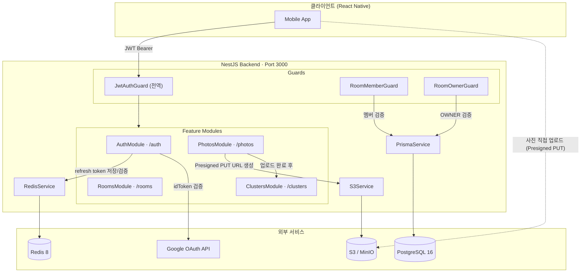
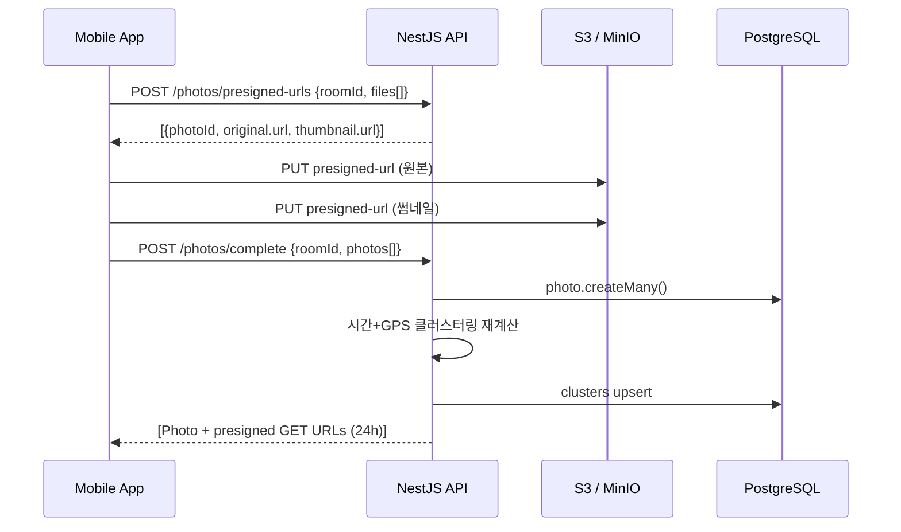

# Post-Travel-Backend

AI 여행 사진 정리 &amp; 여행 블로그 작성 모바일앱

Backend (NestJS 11 + Prisma 7 + PostgreSQL 16 + Redis 8).

### 1. 사전 요구

- Node.js 22 LTS, pnpm 10.x
- Docker Desktop (Compose V2)

### 2. 셋업

```bash
cp .env.example .env
# JWT_ACCESS_SECRET / JWT_REFRESH_SECRET 을 `openssl rand -hex 32` 결과로 교체
# GOOGLE_CLIENT_ID / GOOGLE_CLIENT_SECRET 은 Google Cloud Console에서 발급

pnpm install
docker compose up -d postgres redis minio
pnpm prisma migrate dev
pnpm prisma:seed       # 개발용 dev@example.com / password1234 유저 생성
pnpm start:dev
```

### 3. 주요 스크립트

| 명령                 | 용도                  |
| -------------------- | --------------------- |
| `pnpm start:dev`     | 개발 서버 (핫 리로드) |
| `pnpm test`          | 유닛 테스트           |
| `pnpm test:e2e`      | e2e 테스트            |
| `pnpm lint`          | ESLint 자동 수정      |
| `pnpm typecheck`     | `tsc --noEmit`        |
| `pnpm prisma:studio` | Prisma Studio GUI     |

### 4. 아키텍처



**사진 업로드 플로우**



### 5. 주요 엔드포인트

- `GET /health` — DB + Redis 상태
- `POST /auth/signup` / `POST /auth/login` / `POST /auth/refresh` / `POST /auth/logout`
- `GET /auth/google` / `GET /auth/google/callback`
- Swagger UI: http://localhost:3000/docs
